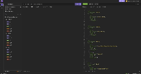

# E-commerce Back End 

## Description
This e-commerce back end was created to practice skills needed to develop a functioning back-end that uses CRUD operations and RESTful APIs. It taught me how to use MySQL in the terminal to run SQL queries, how to use Database Models and associations in Sequelize, how to use Express.js to building RESTful APIs in Node.js, how to protect data in an environment variable, how to seed a database and more.

Demo video here: https://drive.google.com/file/d/15C9HoZHpTTjj_ikan3d2hpVt2XFb1ZOt/view?usp=sharing

## Installation
MySQL: https://www.npmjs.com/package/mysql2

Express: https://www.npmjs.com/package/express

Sequelize: https://www.npmjs.com/package/sequelize

dotenv: https://www.npmjs.com/package/dotenv

## Usage

## Credits
Starter code: https://github.com/coding-boot-camp/fantastic-umbrella

Sequelize Associations: https://sequelize.org/docs/v6/core-concepts/assocs/

Sequelize Model Querying: https://sequelize.org/docs/v6/core-concepts/model-querying-basics/#simple-update-queries

## License
n/a